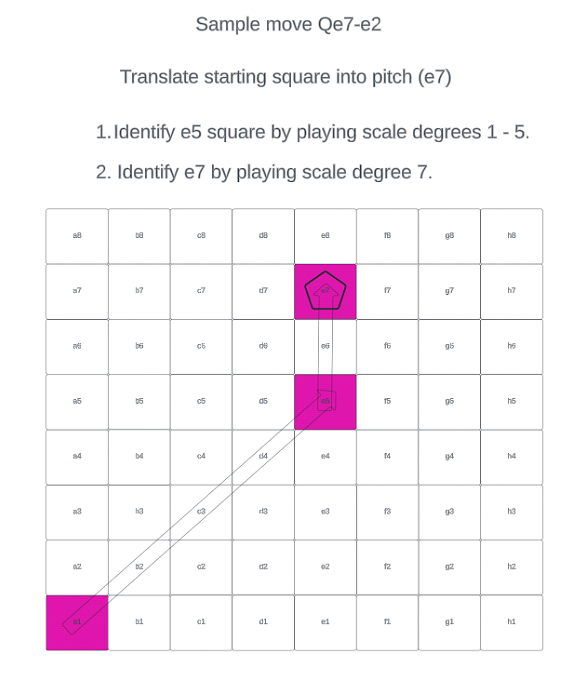
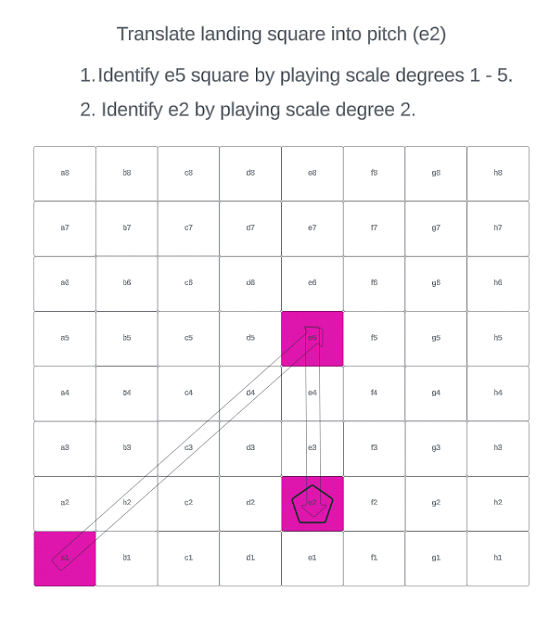

<h1 align="center">Cantus: The Musical Language of Chess</h2>

  A formal grammar that encodes chess moves as melodic phrases.

### Core Idea

Every chess move is communicated as **music alone**.  

Players and the engine exchange moves using short phrases on a MIDI keyboard.  

The board is never seen, only heard.

---

## Syntax of a Move

A move (except promotions) requires **two phrases**:

1. **Starting square** (where the piece begins)
2. **Landing square** (where the piece moves)

### **Step 1: Starting Square**
Find the file’s **reference square** on the a1–h8 diagonal.  

&nbsp;&nbsp;&nbsp;&nbsp;&nbsp;&nbsp; White: begin from scale degree **1** (tonic) and ascend to the reference.  

&nbsp;&nbsp;&nbsp;&nbsp;&nbsp;&nbsp; Black: begin from scale degree **8** (octave) and descend to the reference.  

Then move to the scale degree representing the actual rank.

**Examples**  

&nbsp;&nbsp;&nbsp;&nbsp;&nbsp;&nbsp; White e5 → `1 – ↑5`  

&nbsp;&nbsp;&nbsp;&nbsp;&nbsp;&nbsp; Black e5 → `8 – ↓5`  

&nbsp;&nbsp;&nbsp;&nbsp;&nbsp;&nbsp; White e7 → `1 – ↑5 – ↑7`  

&nbsp;&nbsp;&nbsp;&nbsp;&nbsp;&nbsp; Black e7 → `8 – ↓5 – ↑7`

### **Step 2: Landing Square**
Apply the same process again for the target square.  

**Example: e7 → e2**  

&nbsp;&nbsp;&nbsp;&nbsp;&nbsp;&nbsp; White: `1 – ↑5 – ↑7 , 1 – ↑5 – ↓2`  

&nbsp;&nbsp;&nbsp;&nbsp;&nbsp;&nbsp; Black: `8 – ↓5 – ↑7 , 8 – ↓5 – ↓2`  

In C major:  

&nbsp;&nbsp;&nbsp;&nbsp;&nbsp;&nbsp; White → `C–↑G–↑B , C–↑G–↓D`  

&nbsp;&nbsp;&nbsp;&nbsp;&nbsp;&nbsp; Black → `C–↓G–↑B , C–↓G–↓D`

---

## Special Motifs

### **File Signatures**  

The A-file and H-file are distinct edge cases:

&nbsp;&nbsp;&nbsp;&nbsp;&nbsp;&nbsp; **A-file**  

&nbsp;&nbsp;&nbsp;&nbsp;&nbsp;&nbsp;&nbsp;&nbsp;&nbsp;&nbsp;&nbsp;&nbsp; - Example: `a1 = 1 – ↓7 – ↑1` (inverted 
mordent on tonic marks the A-file)

&nbsp;&nbsp;&nbsp;&nbsp;&nbsp;&nbsp;&nbsp;&nbsp;&nbsp;&nbsp;&nbsp;&nbsp; - Example: `a5 = 1 – ↓7 – ↑1 – ↑5` (mordent 
for A-file, then up to 5th for rank 5)  

  **Rule:** Always begin with the inverted mordent `1 – ↓7 – ↑1`, then continue to the rank.  

&nbsp;&nbsp;&nbsp;&nbsp;&nbsp;&nbsp; **H-file**  

&nbsp;&nbsp;&nbsp;&nbsp;&nbsp;&nbsp;&nbsp;&nbsp;&nbsp;&nbsp;&nbsp;&nbsp; - Example: `h8 = 1 – ↑8` (octave up the h8 
square at the top rank)  

&nbsp;&nbsp;&nbsp;&nbsp;&nbsp;&nbsp;&nbsp;&nbsp;&nbsp;&nbsp;&nbsp;&nbsp; - Example: `h4 = 1 – ↑8 – ↓4` (octave leap 
for H-file, then descend to 4th rank)  

**Rule:** Always begin with the octave leap `1 – ↑8` to mark H8 as the reference, then move to the rank.  

---

## **Castling**  

Castling uses a unique opening motif to signal it clearly:

1. Begin with: `1 – ↑#4 – ↑5`  
2. Then add a short improvisation to indicate side:  
&nbsp;&nbsp; - **Kingside:** improvise an **ascending run** starting from 5  
&nbsp;&nbsp; - **Queenside:** improvise a **descending run** starting from 5  

---

## **Pawn Promotion** 

Promotion is a **two-step signal**:

1. **Signal promotion** by playing an ascending minor second: `1 – ↑♭2`  
2. **Identify the chosen piece** using the tetrachord (1, ♭2, ♭3, ♮3):  
   - Rook = 1  
   - Knight = 2  
   - Bishop = 3  
   - Queen = 4  

**Examples**

&nbsp;&nbsp;&nbsp;&nbsp;&nbsp;&nbsp; Promote to Queen:   `1 – ↑♭2 , 1 – ↑♭2 – ↑♭3 – ↑♮3`  

&nbsp;&nbsp;&nbsp;&nbsp;&nbsp;&nbsp; Promote to Rook: 
  `1 – ↑♭2 – 1`  

---

## **Draw Offers**

Draw offers have two parts: **making the offer** and **responding**.

### Offer a Draw
1. Play your move normally.  
2. Play the first scale degree (e.g., **C**).  
3. Descend to any pitch (e.g. **B♭, B♮, A**).  
4. Improvise an **ascending, questioning phrase**.

### Respond to a Draw
**Accept:** play a **long response** (extended melodic phrase, ≥ 5 notes).  

**Decline:** play a **short response** (brief melodic phrase, ≤ 4 notes).  

---

## Ornamentation

Ornamentation is allowed, but the **core identifying tones must always be clear and accented**.  

Use decoration to add character without obscuring the square.

- **Captures:** add color tones in **Phrygian** or **Lydian** mode  
- **Non-captures:** decorate in **Ionian** or **Dorian** mode  
- **Checks:** add an **appoggiatura** on the final pitch (grace note resolving into it)  
- **Optional coloration:** if the final pitch is scale degree 2, 3, 6, or 7, you may flatten it for expressive effect  

**Rule of thumb:** the last sustained pitch always identifies the square, even if ornaments or grace notes precede it.

## Concluding Figures

Special motifs mark the end of the game:

**Resignation / Checkmate:** improvise any phrase that begins with an **ascending minor ninth interval**  

**Stalemate:** the player who caused the stalemate plays a **three-note figure**, pauses, then repeats it; the opponent echoes the same figure back (optionally harmonized at a fourth or fifth above)  

---

  

  

---

  ♩ ♪ ♫ ♬ ♭ ♮ ♯ — The Cantus system defines the musical contract that makes a full chess game playable entirely through sound.

